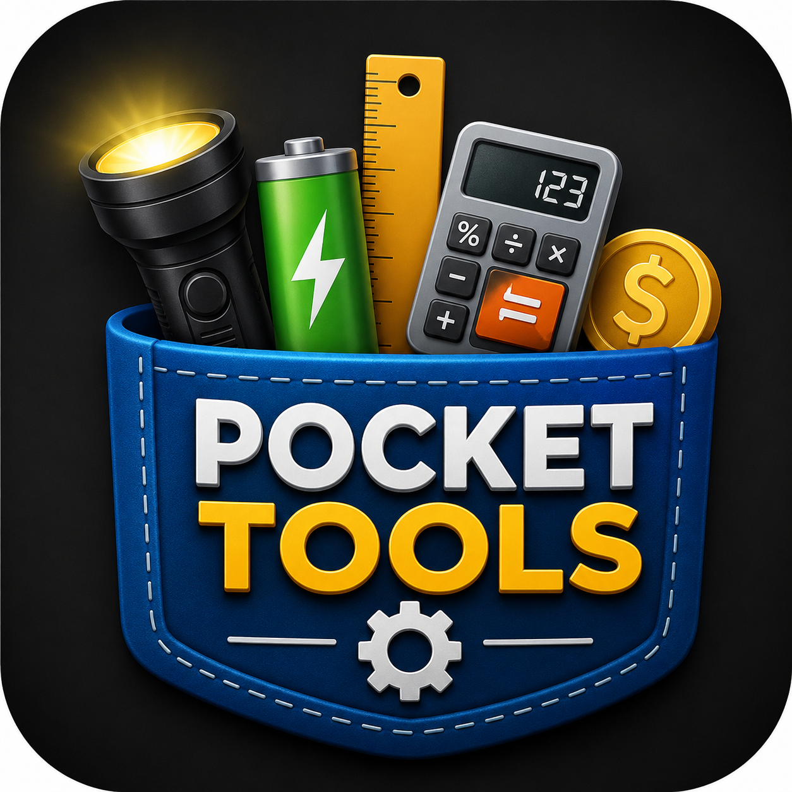

# Pocket Tools

A simple Android toolbox with everyday utilities.

## Why I built it

I created Pocket Tools because I got tired of digging through phone settings just to find simple information like battery percentage. On newer phones, some useful information can be harder to quickly access, so I built a simple toolbox that keeps everyday tools in one place.

## Features

- QR Scanner
- QR Generator
- QR History
- Flashlight
- Battery Information
- Unit Converter
- Tip Calculator
- Discount Calculator
- Notes
- Favorites

## Download

APK:
https://apkpure.com/pocket-tools/com.example.pockettools

## Screenshots

## Feedback

Suggestions and bug reports are welcome.

## Status

Currently in development.
